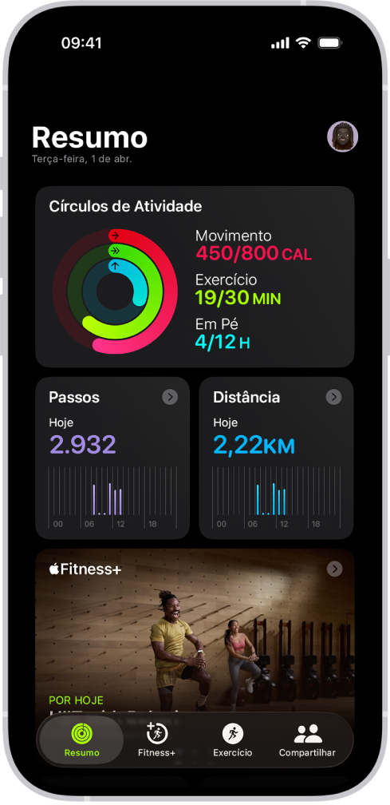

# Fitness Landing Page

Uma landing page clean e moderna para um app fitness, criada com foco em design minimalista, espaçamento equilibrado e apresentação clara dos recursos.

## Descrição

Esta landing page apresenta um app de fitness que ajuda o usuário a acompanhar calorias, treinos e a comunidade de amigos de forma simples e elegante.

A página foi pensada para destacar:
- mensagem direta e objetiva;
- visual do app em destaque;
- benefícios de saúde, exercício e socialização;
- chamada para ação com download e promessa de uso gratuito.

## Badges

## Tecnologias

- HTML5
- CSS3
- Google Fonts (Roboto)
- Imagens customizadas para apresentação do app

## Funcionalidades destacadas

- Seção hero com mensagem de impacto e apresentação visual do app
- Recursos de acompanhamento de calorias
- Planos de treino personalizados e específicos
- Integração social para compartilhar conquistas com amigos
- CTA forte com botão de download e selo de "100% GRATUITO"

## Como contribuir

1. Faça um fork deste repositório.
2. Crie uma branch com sua melhoria: `git checkout -b feature/nome-da-sua-idea`
3. Faça commits claros e concisos.
4. Envie um pull request descrevendo sua melhoria.

> Sugestões de contribuição: melhorias no layout responsivo, animações sutis, novas seções para depoimentos ou planos, e otimização de performance.

---

Feito com carinho para uma experiência fitness digital mais bonita e engajadora.